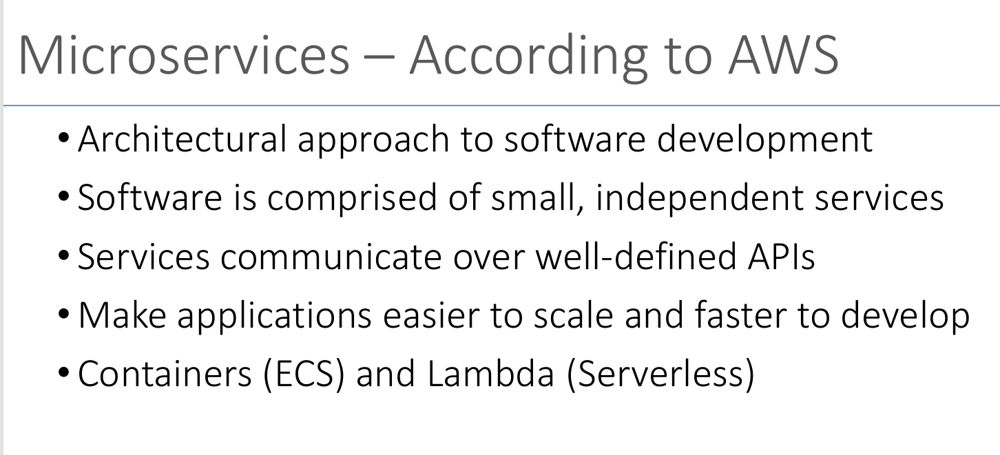
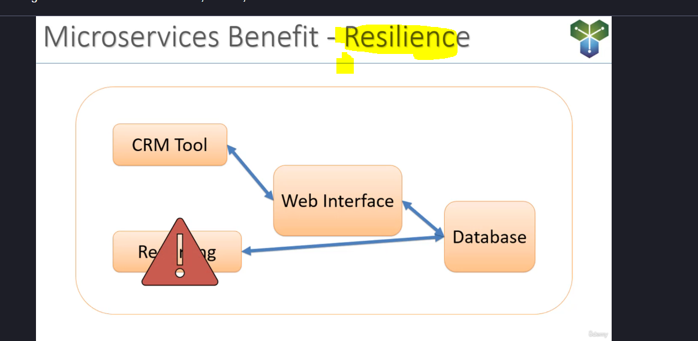
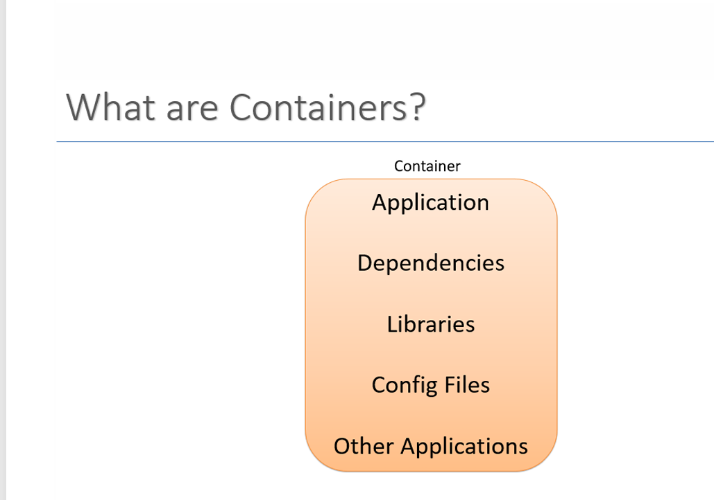
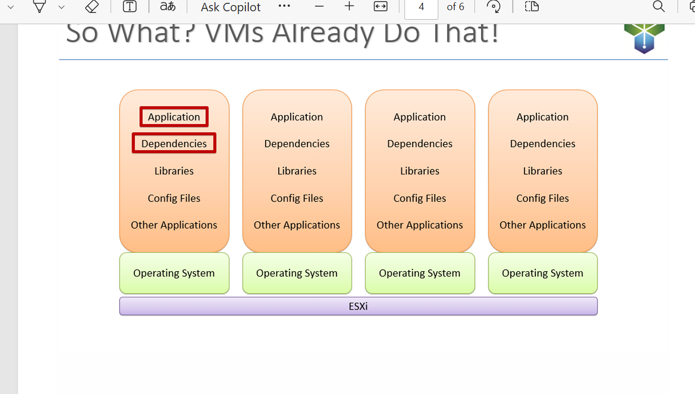
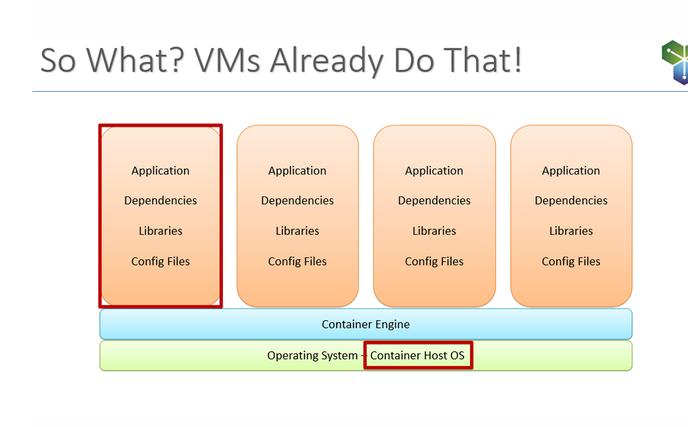
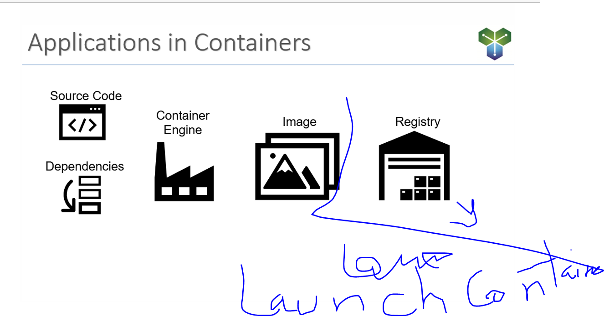
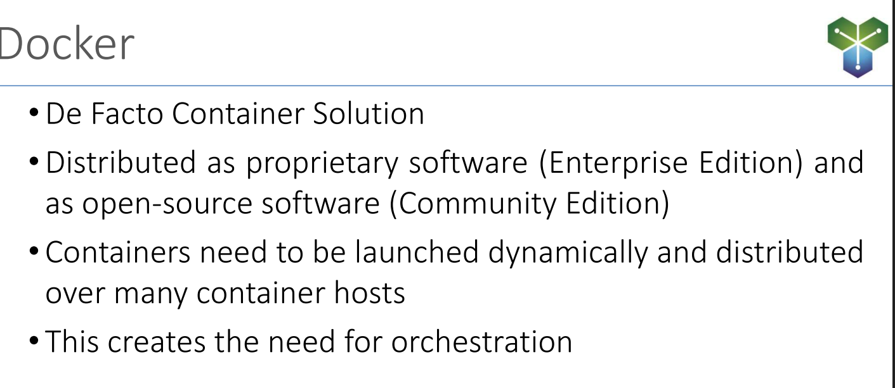
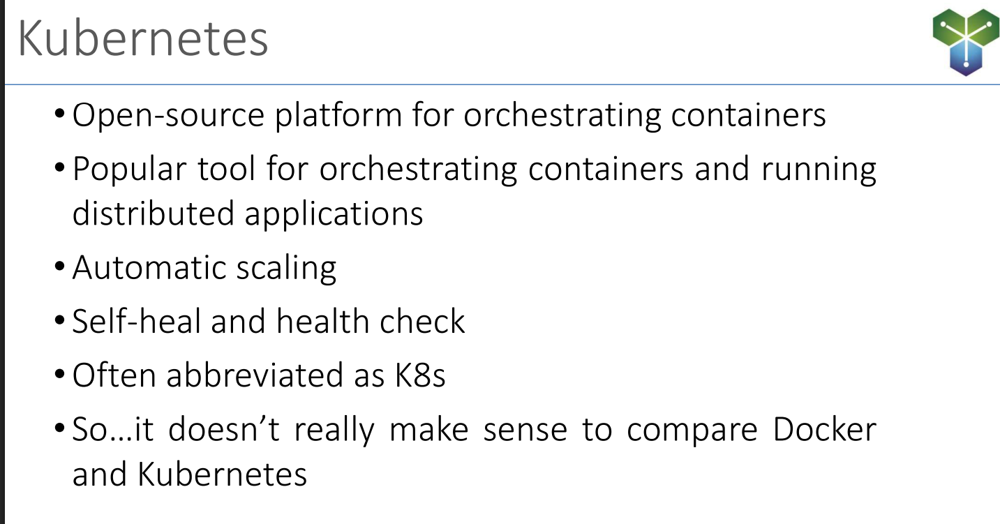
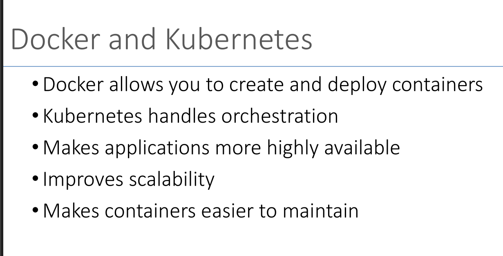

# Container and Microservices Documentation

## Table of Contents
- [Key Concepts](#key-concepts)
- [Benefits of Microservices](#benefits-of-microservices)
- [Disadvantages of Microservices](#disadvantages-of-microservices)
- [Containers vs Virtual Machines](#containers-vs-virtual-machines)
- [Container Flow](#container-flow)
- [Scaling Strategies](#scaling-strategies)
- [Docker and Kubernetes](#docker-and-kubernetes)
- [Docker Deep Dive](#docker-deep-dive)
  - [Docker: Container Management Software](#11-docker-unveiling-the-container-management-software)
  - [The Docker Engine](#12-the-docker-engine-the-runtime-platform)
  - [Docker Images](#13-demystifying-docker-images-blueprints-for-containers)
  - [Docker Containers](#14-unveiling-the-power-of-docker-containers)
- [Docker Lab: Hello World](#lab-manual-running-hello-world-in-docker)
- [Docker Lab: Python App](#docker-lab-python-application)
- [Additional Resources](#additional-resources)

## Key Concepts

### Containers
Containers are small independent processes which do not require a VM.

### Microservices
A microservice is a small service that does one task.

## Define Microservice


### API
API is the common language through which various microservices in different languages can talk.

## Benefits of Microservices
- Resilience
- Flexible Scaling
- Easy deployment



## Disadvantages of Microservices
- Latency issues
- Complexity
- Distribution causes more calls
- *TODO: Add more disadvantages*

## CONTAINER


## Containers vs Virtual Machines

### Virtual Machines
VMs require a full OS installation and hypervisor, making them more resource-intensive.



### Containers
Containers share the host OS kernel and are more lightweight, providing better resource efficiency.



## Container Flow
Containers follow a defined lifecycle from creation to execution.



## Scaling Strategies

### Horizontal vs Vertical Scaling
- **Horizontal Scaling**: More elastic - scales when needed
  - 1 pod becomes multiple pods (like building multiple houses)
  - Lambdas use this approach and are managed by AWS
  
- **Vertical Scaling**: Adding more resources to existing containers
  - Like adding floors to an existing house (more CPU/memory)

## Docker and Kubernetes
Docker manages individual containers, while Kubernetes orchestrates container deployments at scale.







## Docker Deep Dive

### 1.1 Docker: Unveiling the Container Management Software
Docker serves two primary purposes:
- **Container Management Software**: Docker acts as the central hub for managing your containerized environment. It allows you to:
  - Manage Docker images: These are blueprints that define the structure and contents of your containers.
  - Manage Docker volumes: These are persistent storage directories that containerized applications can leverage to store data independent of the container itself.
  - Manage Docker containers: These are the running instances of your applications built from Docker images.

### 1.2 The Docker Engine: The Runtime Platform
The Docker engine is a software program that runs on various operating systems (Linux, Windows Server) and provides the underlying runtime environment for your Docker containers. It essentially acts as the platform upon which your containers execute.

### 1.3 Demystifying Docker Images: Blueprints for Containers
- **What is a Docker Image?** An image is a self-contained template that defines the instructions for building a Docker container. It encapsulates everything required to run an application, including:
  - The application code itself
  - The operating system libraries and dependencies the application needs
  - Configuration files

- **Layering Docker Images**: Images are constructed in a layered fashion. Each layer represents a specific instruction or step in the build process. This layered approach makes image creation efficient as subsequent containers based on the same image can reuse existing layers, reducing storage requirements.
  - Base Layer: The foundation of an image typically consists of a base operating system (e.g., Ubuntu, Debian).

- **Benefits of Docker Images**:
  - Portability: Since images contain everything a container needs, they are portable across different computing environments (physical machines, virtual machines, cloud platforms) as long as Docker is installed. This simplifies application deployment and streamlines development workflows.
  - Repeatability: Images ensure consistent application environments. Developers can be confident that their applications will run reliably regardless of the underlying system configurations.

### 1.4 Unveiling the Power of Docker Containers
- **What is a Docker Container?** A container is a running instance of a Docker image. It's a lightweight, self-contained unit that encapsulates an application and all its dependencies. This ensures that the application runs consistently across different environments.

- **Key Advantages of Containers**:
  - Fast Startup Times: Containers share the underlying operating system kernel with the host machine, eliminating the need to boot a separate OS for each container. This translates to significantly faster startup times compared to traditional virtual machines.
  - Resource Efficiency: Containers share the host system's resources, leading to efficient resource utilization compared to virtual machines, which allocate dedicated resources even when idle.
  - Isolation: Containers are isolated from each other and the host system, enhancing security and preventing conflicts between applications.

- **Real-World Example**: Consider a scenario where you have a containerized WordPress application. Multiple developers can work on this project simultaneously even if their development environments differ. The container itself includes all the necessary components (code, libraries, dependencies) to run WordPress, eliminating discrepancies caused by variations in individual development setups.

## Lab Manual: Running "Hello World" in Docker

### Step 1: Verify Docker Installation
```bash
docker --version
```

### Step 2: Run Hello World Container
```bash
docker run hello-world
```
**Explanation**:
- `docker run`: Creates and starts a new container
- `hello-world`: Name of the Docker image to run

### Step 3: List Docker Images
```bash
docker images
```
**Expected Output**:
```
REPOSITORY    TAG       IMAGE ID       CREATED        SIZE
hello-world   latest    d1165f221234   2 months ago   13kB
```

### Step 4: Inspect the Container
```bash
docker ps -a
```
**Explanation**:
- `docker ps -a`: Displays all containers, whether running or stopped

**Expected Output**:
```
CONTAINER ID   IMAGE         COMMAND    CREATED          STATUS                      PORTS   NAMES
123abc45defg   hello-world   "/hello"   1 minute ago     Exited (0) 1 minute ago             quirky_panini
```

### Step 5: Clean Up
```bash
docker rm <CONTAINER ID>
docker rmi hello-world
```
**Explanation**:
- `docker rm`: Deletes containers
- `docker rmi`: Deletes images from the local system

## Docker Lab: Python Application

### Step 1: Create Project Directory
Create a directory named `rick-docker` to hold your project files.

### Step 2: Write a Simple Python Script
Create a file named `app.py` in the `rick-docker` folder:

```python
print("Hello from Docker!")
```

### Step 3: Create a Dockerfile
Create a file named `Dockerfile` (no extension) in the same folder:

```dockerfile
# Use an official Python runtime as a base image
FROM python:3.9-slim

# Copy the Python script into the container
COPY app.py /app/app.py

# Set the working directory
WORKDIR /app

# Define the command to run the Python script
CMD ["python", "app.py"]
```

**Explanation**:
- `FROM`: Specifies the base image to use (Python 3.9 slim version)
- `COPY`: Copies the app.py file from your local system into the container
- `WORKDIR`: Sets the working directory for subsequent commands
- `CMD`: Specifies the command to run when the container starts

### Step 4: Build the Docker Image
```bash
docker build -t my-python-app .
```

**Explanation**:
- `docker build`: Command to build a Docker image
- `-t my-python-app`: Tags the image with the name "my-python-app"
- `.`: Refers to the current directory where the Dockerfile is located

### Step 5: Run the Docker Container
```bash
docker run my-python-app
```

**Expected Output**:
```
Hello from Docker!
```

### Step 6: Verify the Docker Image
```bash
docker images
```

### Step 7: Clean Up
```bash
docker ps -a
docker rm <CONTAINER ID>
docker rmi my-python-app
```

## Additional Resources
- [Kubernetes vs Docker Swarm](https://www.bmc.com/blogs/kubernetes-vs-docker-swarm/)